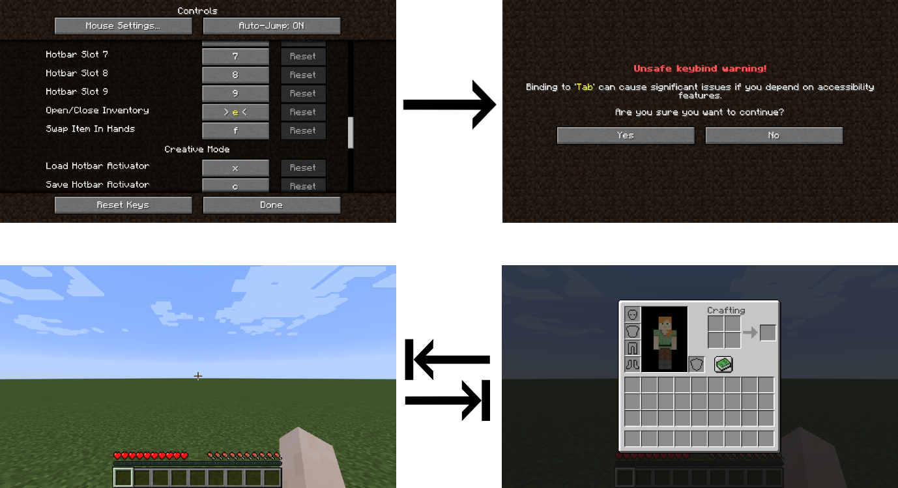

# Tab Inventory for Fabric

Fabric mod that allows the inventory key to be Tab just like in 1.13. For Minecraft 1.15 and above.

# [Download here](https://www.curseforge.com/minecraft/mc-mods/tab-inventory-fabric)

Requires [Fabric Mod Loader](https://fabricmc.net/) and Minecraft 1.15 (or 1.16 snapshots).

The main focus of this mod is to fix [MC-145691](https://bugs.mojang.com/projects/MC/issues/MC-145691).  
_In current versions of Minecraft you are able to bind and open your inventory with tab, but it's **not possible** to close it with tab again._

It does try to comply with accessible guidelines by asking the user for confirmation.



[Please report any issues](https://github.com/0blu/TabInventory-Fabric/issues) (even if there are coming from other mods).

## Setup development environment 
```
./gradlew idea
```

---

Inspired by [Darkere's TabInventory Mod](https://github.com/Darkere/TabInventory) for Forge

License: [Apache License 2.0](./LICENSE.txt)
